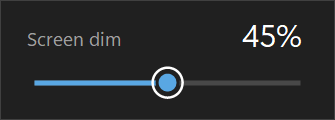

# dim

A screen dimmer for Windows that goes darker than your monitor's own 0%.

One 17 KB executable. Double-click it and it's in your tray. No installer, no
runtime to fetch, no PowerShell policy to change, no shortcut to configure.



## Why

Monitor brightness bottoms out well above "comfortable" in a dark room, and on
external displays the Windows brightness slider often does nothing at all. `dim`
draws a click-through black overlay on every monitor instead, so it keeps
darkening past whatever floor your hardware has.

## Use

Download `dim.exe` and double-click it. A half-moon icon appears in the
notification area — left-click for the slider, right-click for Exit. Exiting
always restores full brightness.

The slider takes drag, scroll wheel, arrow keys (±5), and Home/End. Esc closes
it; so does clicking anywhere else.

| Argument | Effect |
|----------|--------|
| `--percent 60` | start at 60% instead of 0 |
| `--test` | run the self-check and quit |

### Start it with Windows

Press `Win+R`, run `shell:startup`, and drop `dim.exe` (or a copy of it) in the
folder that opens. That's the whole setup — an `.exe` needs no shortcut and no
launcher, unlike a `.ps1`, which Windows will not run from the startup folder at
all.

## What it does not dim

The overlay is a normal topmost window, which puts a few things out of reach:

| Not dimmed | Why |
|---|---|
| Mouse cursor | Drawn on the hardware cursor plane, above all composition |
| Start menu, Search, Action Center | Live in a higher window band that needs a UIAccess manifest |
| UAC prompt, lock screen, Ctrl+Alt+Del | Separate secure desktop, by design |
| Fullscreen-exclusive games | Bypass the compositor entirely |

Dropdowns and context menus *are* covered — they open above any pre-existing
topmost window, so `dim` re-claims the top every 700 ms. Expect a brief flash
before it catches up.

Adjusting the display **gamma ramp** instead would dim all of the above, since
gamma applies after composition. That was the first implementation and it was
dropped: `SetDeviceGammaRamp` returns false on plenty of machines, because
Windows clamps ICM gamma unless `GdiIcmGammaRange` (DWORD) is set to `256`
under `HKLM\SOFTWARE\Microsoft\Windows NT\CurrentVersion\ICM` followed by a
reboot — and on HDR displays gamma is unavailable no matter what. An overlay
needs no registry edit and no admin rights.

## Notes

- Capped at 90%. A 100% overlay is an unrecoverable black screen — you could not
  find the slider to undo it.
- Overlays are built once at startup. Plug in a monitor later and it stays
  undimmed until you restart.
- Theme and accent colour are read from the registry at startup, so switching
  Windows between light and dark needs a restart.
- The binary is unsigned. Downloading it from GitHub attaches a mark-of-the-web,
  so SmartScreen will warn on first run — build it yourself if you'd rather not
  click through that.

## Build

```bat
build.cmd
```

Uses `csc.exe` from the .NET Framework that ships with Windows. There is nothing
to install: no SDK, no NuGet, no package manifest. Output is a single
self-contained `dim.exe`.

## Self-check

```bat
dim.exe --test
```

Covers the pointer→value math, clamping at both ends, overlay opacity, tray and
label text, and renders the flyout to `%TEMP%\dim-flyout.png` so a
silently-thrown paint handler shows up as a blank image.
